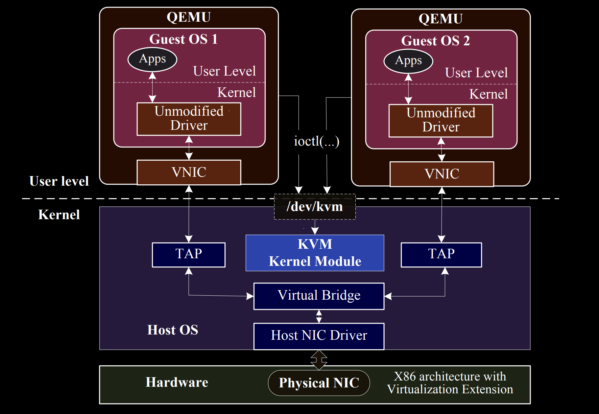
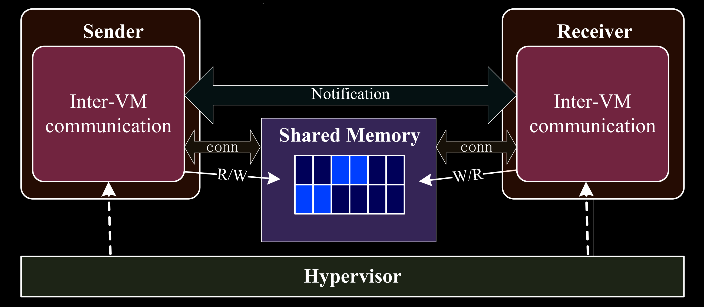
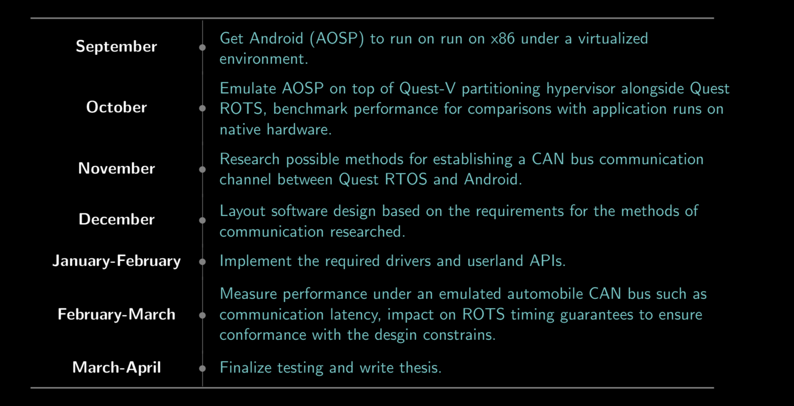

name: title-layout
layout: true
class: center, middle, title
---
name: basic-layout
layout: true
class: left, top
???
These two slides are the templates to be used for the rest of the presentation

---
name: title
template: title-layout
# Senior Thesis PDRR
.footnote[Vijay Thakkar, Prof. Rich West]
???
SLIDE 0: Title

---
name: thesis-statement
template: title-layout
#### Design a proof of concept system that allows for Android OS to be emulated on x86 hardware to serve as a host for low criticality (infotainment) processing in the presence of a high criticality sister guest. 
???
SLIDE 1: Thesis Statement
- Infrastructure for heterogenous mixed criticality compute for the cars of the future

---
name: can-cannot
.center[]
???
SLIDE 2: CAN Diagram and The CAN Issue
- CAN buses dominate communication in automobiles.
- But this is not scalable for modern cars that have very heavy compute needs.

---
name: rtos
template: basic-layout
## Real Time Operating System
- Time is a first class resource
- Need to ensure control systems processing has no delays
- Unification is essential for the automobiles of the future

---
name: can-cannot-2-electric-boogaloo
template: basic-layout
## Easy, do both separately!
- No, still need CAN for control and infotainment
- But RTOS cannot do infotainment, it is breaking your car!
- CAN ... cannot?
???
- can ~cannot~ do this
- Right now they just have both
- But what if we could unify everything under a single multi-core processor?

---
name: consolidation-issues
template: basic-layout
## Issue With Consolidation
- Let RTOS do control processing for CAN
- Still need to share data for low criticality processing
- But that breaks ROTS timing guarantees
???
SLIDE 3: Problem with consolidation
- cannot let RTOS do everything even if consolidated
- Need different OSes so that we can process separately

---
name: solution
template: title-layout
## Share CAN buffer with another OS and partition hardware

---
name: shared-nic-example
.center[]
???
SLIDE 4: NIC Share Diagram
- Historic method of setting up cross-vm comms.
- TCP overhead kills this in terms of latency.
- Also much more powerful than we need this to be

---
name: requirements
class: center, title
## Requirements
- Setup a shared memory region between two Guest OSes
- Provide low latency read-write access to it
- Preserve security aspects of virtualization
- Ensure no side-effects for high criticality processing of ROTS
.center[]
???
SLIDE 5: Requirements
- What needs to get done basically

---
name: method
template: basic-layout
## Nice... how?
1. Configure MMU to map phys-mem and agree on region (type 1)
2. Init shmem in host, mount as ramdisk and mmap in guests (type 2)
3. Write drivers in guests to ensure a secure API for userland

---
name: deliverables
template: basic-layout
## Deliverables
- Linux (host) driver to set up the shared buffer
- Linux (guest) driver as a producer for buffer
- Android (guest) driver as consumer of buffer
- A running demo on actual hardware
- Possible implementation with Quest and Quest-V
???
SLIDE 6: Thesis Statement
- Infrastructure for heterogenous mixed criticality compute for the cars of the future

---
name: timeline
class: middle, center

???
SLIDE 7: Timeline of work to be done
- Checkpoint one already done
